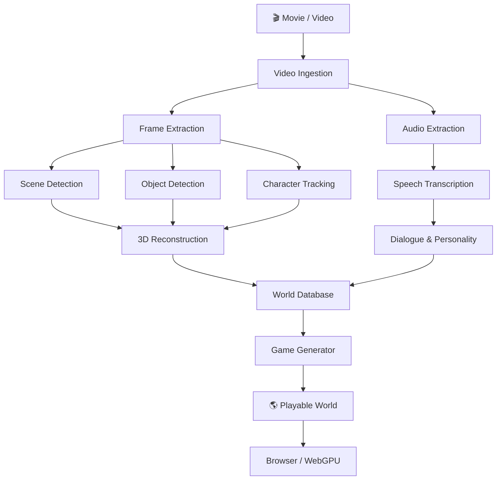

# 🎮 KUS WORLD ENGINE

> **Turn film into playable 3D worlds** — a browser-based AI game engine that reconstructs movies into interactive, explorable environments.



## Architecture

The engine uses a **progressive, multi-stage pipeline** to transform raw video into a game-ready world:

| Stage | What it does |
|-------|-------------|
| **Ingest** | Loads video metadata, prepares for processing |
| **Extract** | Chops video into frames and audio segments |
| **Analyze** | Detects scenes, shots, and camera transitions |
| **Detect** | Identifies objects, characters, and props (YOLO/RT-DETR) |
| **Track** | Follows characters across frames (ByteTrack/DeepSORT) |
| **Transcribe** | Converts speech to text (Whisper) |
| **Reconstruct** | Builds 3D geometry from 2D footage (COLMAP/3DGS/NeRF) |
| **Build** | Assembles interactive game world with physics & AI |
| **Spawn** | Drops the player into the world |

## Tech Stack

- **3D Engine**: [Babylon.js 7.x](https://babylonjs.com) with WebGPU
- **Language**: TypeScript
- **Physics**: Rapier (WASM)
- **AI Pipeline**: Python + PyTorch workers (cloud), WebSocket/WebRTC
- **Storage**: glTF/GLB assets, indexed world database
- **Frontend**: Static HTML + ES Modules (importmap CDN)

## Getting Started

Simply open `index.html` in a browser that supports **WebGPU** (Chrome 113+, Edge 113+).

1. Drop a video file onto the landing page
2. Watch the AI pipeline reconstruct it
3. Explore the resulting 3D world with WASD + mouse

## Development

```bash
# The app runs as static HTML + ES modules
# No build step required for development
# Babylon.js is loaded via importmap from esm.sh CDN
```

## MVP Roadmap

**v0.1** — One 5–10 minute video → explorable 3D scene:
- [x] Landing page UI with drag-and-drop
- [x] Babylon.js 3D renderer with procedural demo world
- [x] Progressive pipeline with real-time progress
- [x] WASD + mouse controls
- [ ] Real video frame extraction (WebCodecs)
- [ ] AI scene analysis integration
- [ ] 3D reconstruction from video frames

---

Vibed with [Shakespeare](https://shakespeare.diy)